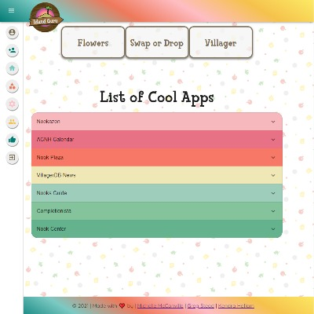

# [Island Guru](https://island-guru.herokuapp.com/) 🔗


## Description

An Animal Crossing 🦁 New Horizon React App that will display information useful in the game.

| ***Login Page***              | ***Registration Page***                     |
| :---------------------------: | :-----------------------------------------: |
|  |  |
| ***Home Page***               | ***Flowers Page***                          |
|    |            |
| ***Items Page***              | ***Villager Page***                         |
|  |          |

## Table of Contents ✨

* [Technology Used](#technology)
* [User Story](#us)
* [Repository](#repo)
* [Contributing](#contributing)
* [Tests](#tests)
* [Questions](#questions)
* [License](#license)

## Technology Used 🛠️ <a name="technology"></a>

```.
  HTML - CSS - JavaScript - Material-UI
  Node - MySQL - Express - Sequelize - React - Heroku - Axios
```

## User Story 📖‍ <a name="us"></a>

```md
AS a ACNH (Animal Crossing New Horizon) Player, I want to be able to access the Island Guru App which will allow me to find information about items (in my bag), view flowers, and display villagers. In addition I will be able to view additional resources that will direct me to other useful websites.
```

## Repository ⚙️ <a name="repo"></a>

https://github.com/gregstead/island_guru

## Contributing 🤝 <a name="contributing"></a>

All contributions must be approved by owners

## Tests ✅ <a name="tests"></a>

There are currently no testing procedures for this application

## Questions ❓ <a name="questions"></a>

* 📧 If you have any questions please [**eMail**](mailto:dev.mchel@gmail.com) me
* :octocat: Check out more of our work on
  * [**Michelle's GitHub**](https://michellemcconville.github.io/08-updated-portfolio/portfolio.html)
  * [**Kendra's GitHub**](https://kjhallam.github.io/portfolio.html)
  * [**Greg Github**](https://github.com/gregstead)

## License 📝 <a name="license"></a>

This project is **`Massachusetts Institute of Technology`** licensed

---

 Copyright ©️ 2021 🌻 Michelle McConville | Kendra Hallam | Greg Stead
